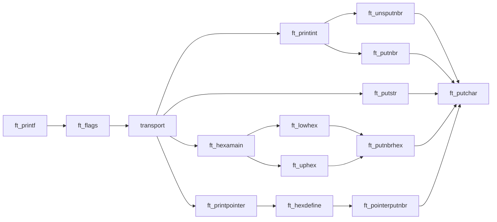

# 42_ftprintf

### Recreating the C standard library function printf()

# libft functions used
Function | Description
--|--|
`ft_putchar.c` | Output a char to the standard output
`ft_putnbr.c` | Output any number inserted to the standard output
`ft_putstr.c` | Output any string inserted to the standard output

# Files
Name | Description | Status 
--|--|--
`ft_printf.c`| Receives the arguments and sends them to a function to print them | ⠀✓
`ft_flags.c` | Receives the flags and sends them to the functions that will print it | ⠀✓
`ft_printint.c` | Prints integers, doubles and unsigned int | ⠀✓
`ft_printhexa.c` | Prints any number in it's hexadecimal | ⠀✓
`ft_printpointer.c` | Prints the address of the pointer received | ⠀✓

# More info

<b>Functions Map</b>

